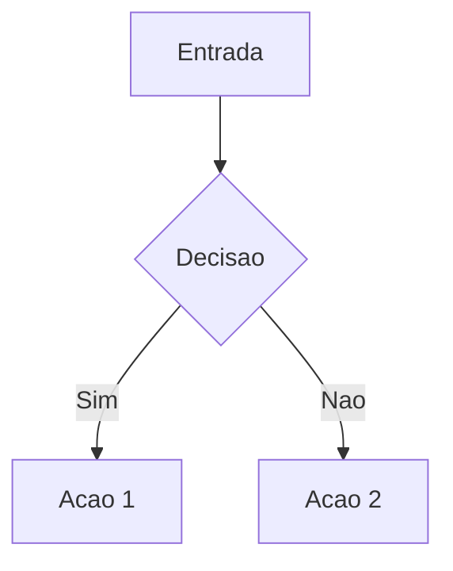

# Programming Rules - Engineering Knowledge Base

Regras de padronizacao de codigo e conteudo para o KB. Skills completas (Python, FastAPI, React, diagramas, etc.) estao em `.claude/skills/`.

---

## Skills Disponiveis (este repo)

**SEMPRE consultar as skills antes de implementar:**

### Backend

- **FastAPI:** `.claude/skills/backend/fastapi/SKILL.md`
- **Django:** `.claude/skills/backend/django/SKILL.md`
- **Python:** `.claude/skills/backend/python/SKILL.md`
- **Node.js:** `.claude/skills/backend/nodejs/SKILL.md`

### Frontend

- **React:** `.claude/skills/frontend/react/SKILL.md`
- **CSS:** `.claude/skills/frontend/css/SKILL.md`

### Infrastructure

- **Docker Compose:** `.claude/skills/infrastructure/docker-compose/SKILL.md`
- **Docker Execution:** `.claude/skills/infrastructure/docker-execution/SKILL.md`
- **Docker Entrypoint:** `.claude/skills/infrastructure/docker-entrypoint/SKILL.md`
- **Dockerfile Generator:** `.claude/skills/infrastructure/dockerfile-generator/SKILL.md`
- **Makefile:** `.claude/skills/infrastructure/makefile/SKILL.md`
- **Deployment:** `.claude/skills/infrastructure/deployment/SKILL.md`

### Workflow

- **Code Modification:** `.claude/skills/workflow/code-modification/SKILL.md`
- **Ruff (Linter/Formatter):** `.claude/skills/workflow/ruff/SKILL.md`
- **Test Runner:** `.claude/skills/workflow/test-runner/SKILL.md`
- **CHANGELOG:** `.claude/skills/workflow/changelog/SKILL.md`
- **Code Review:** `.claude/skills/workflow/code-review/SKILL.md`
- **Study Summary Rich:** `.claude/skills/workflow/study-summary-rich/SKILL.md`

### Documentation

- **Diagram Generation:** `.claude/skills/documentation/diagram-generation/SKILL.md`
- **Postman:** `.claude/skills/documentation/postman/SKILL.md`
- **Postman Execution:** `.claude/skills/documentation/postman-execution/SKILL.md`

### Integration

- **Notion:** `.claude/skills/integration/notion/SKILL.md`

---

## Notebooks e Tutoriais

### Padrao dos notebooks

- **Diagramas:** Incluir diagramas Mermaid (flowchart, sequenceDiagram, classDiagram) para explicar algoritmo ou fluxo. Ver: `.claude/skills/documentation/diagram-generation/SKILL.md`
- **Explicacoes:** Texto explicativo antes de cada bloco de codigo; passo a passo tecnico.
- **Estrutura:** Titulo, objetivo, diagrama, explicacao, codigo, resumo ou exercicio quando fizer sentido.
- **Revisao:** Aplicar melhores praticas das skills Python e diagram-generation.

### Mermaid (diagramas tecnicos)

Usar para: fluxogramas, sequencia, classes. Nao usar emojis em codigo nem em documentacao tecnica.

---

## Regras Criticas

### 1. Modificacao de Codigo

So alterar o que foi explicitamente solicitado. Ver: `.claude/skills/workflow/code-modification/SKILL.md`

### 2. Python

- Type hints em assinaturas de funcao.
- Ruff para lint e format (substitui Black, isort, Flake8).
- Uma classe por arquivo quando o modulo tiver mais de uma classe; modulo com `__init__.py` se necessario.

### 3. Emojis

PROIBIDO em codigo e documentacao tecnica. Permitido apenas em README principal.

### 4. Seguranca Docker

NUNCA expor variaveis sensiveis em `environment:`; SEMPRE usar `env_file:` para secrets. Ver: `.claude/skills/infrastructure/docker-compose/SKILL.md`

### 5. Git

NUNCA fazer commit/push sem permissao explicita; SEMPRE conventional commits.

---

## Repositorio e ROADMAP

- **Publico:** ROADMAP e docs publicos mostram apenas estrutura atual e status do que esta feito. Sem "proximos passos" nem cronograma.
- **Privado:** Planejamento, cronograma e materiais em `docs-private/` (gitignored).

## Validacao dos projetos de estudo (Knowledge Base)

- **Lista de validacao:** `ROADMAP/03-LISTA-VALIDACAO-KNOWLEDGE-BASE.md` — inventario do que esta feito, do que falta e do que precisa ser validado (notebooks vs PADRAO-NOTEBOOKS, projetos 07-Projects).
- **Contexto do projeto:** Visao em `ROADMAP/00-VISAO-E-ESTRUTURA.md`, status em `ROADMAP/01-STATUS-CONSOLIDADO.md`, fontes em `ROADMAP/02-FONTES-INSUMOS.md`.
- Ao trabalhar em notebooks ou em status/roadmap, consultar a lista de validacao para evitar divergencias (ex.: 05-Vision sem .ipynb de tutorial; LangChain parcial).
